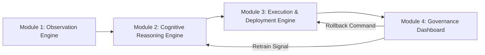
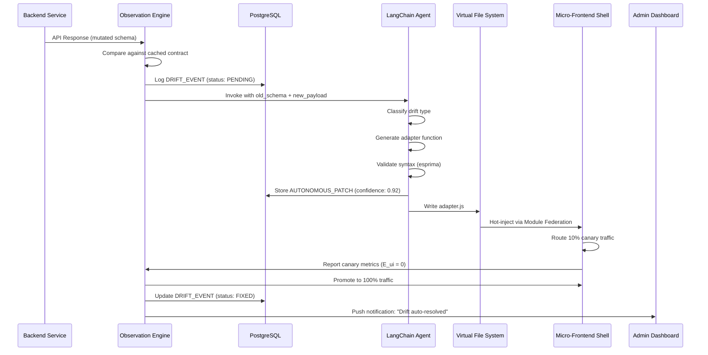
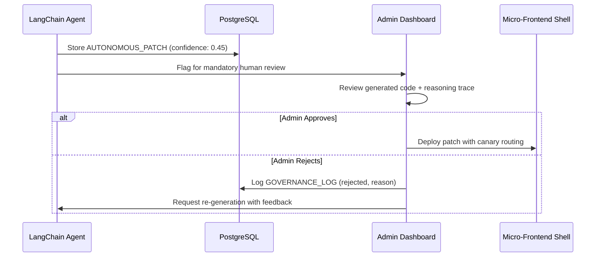
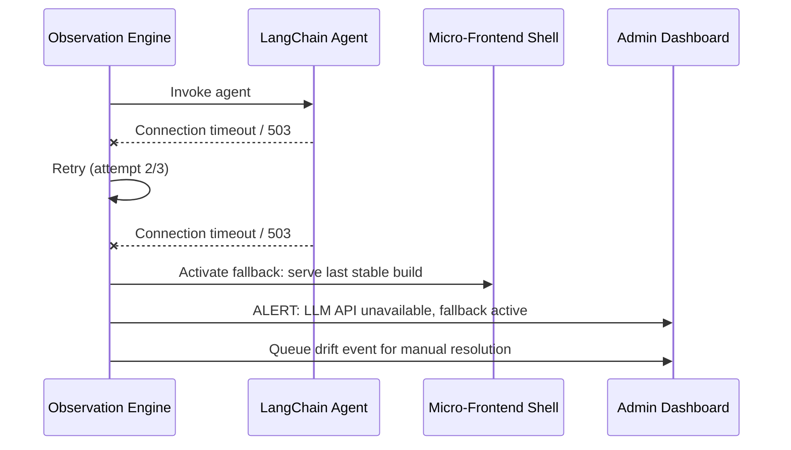

# Chapter 2: System Requirements Specification (SRS)

This document defines the complete functional and non-functional requirements for the Autonomous Micro-Frontend Orchestrator. Requirements are structured per IEEE 830-1998 SRS standards and are traceable to the project objectives defined in Chapter 1.

## 2.1 System Overview

The system consists of **four core modules** that operate as an integrated pipeline:

## 2.2 User Roles and Actors

| Actor | Description | Privileges |
|---|---|---|
| **System (Autonomous)** | The ACP operates without human intervention for detection, generation, and canary deployment | Full automated control within safety thresholds |
| **Platform Administrator** | DevOps or SRE engineer monitoring the dashboard | Approve/reject/rollback patches; configure thresholds; view logs |
| **Frontend Developer** | Consumes the micro-frontend shell; indirectly benefits from automated adapters | View-only access to drift history and generated patches |
| **Backend Developer** | Deploys upstream microservices that trigger drift events | No direct interaction with the system; actions are passively observed |

## 2.3 Functional Requirements (FRs)

### Module 1: The Observation Engine (Telemetry)

| ID | Requirement | Priority | Traces To |
|---|---|---|---|
| **FR-1.1** | The system MUST automatically intercept all outgoing HTTP/HTTPS requests from the Micro-Frontend shell to backend microservices using a transparent reverse-proxy middleware layer. | Critical | O1 |
| **FR-1.2** | The system MUST parse backend OpenAPI 3.0 / Swagger 2.0 specifications at boot time and cache the structural definition of all response data objects (JSON Schema) in the `API_CONTRACTS` database table. | Critical | O1 |
| **FR-1.3** | The system MUST compare every intercepted API response payload against the cached contract definition using structural schema comparison (Jaccard distance). | Critical | O1 |
| **FR-1.4** | The system MUST flag an anomalous **Drift Event** immediately when the structural similarity score $D_c$ drops below a configurable threshold (default: 0.95). | Critical | O1 |
| **FR-1.5** | The system MUST log all intercepted drifts to the `DRIFT_EVENTS` table, including the full old schema snapshot, the new schema snapshot, the computed $D_c$ value, and a timestamp. | High | O1 |
| **FR-1.6** | The system MUST classify detected drifts into categories: `FIELD_RENAMED`, `FIELD_DELETED`, `FIELD_ADDED`, `TYPE_CHANGED`, `NESTING_CHANGED`, `MULTI_FIELD_MUTATION`. | High | O1 |
| **FR-1.7** | The system MUST continue to pass through non-drifted API traffic with zero additional latency (passthrough mode). | Critical | O1 |
| **FR-1.8** | The system MUST support periodic re-ingestion of OpenAPI specs (configurable interval, default: every 60 seconds) to capture legitimate schema updates by backend teams. | Medium | O1 |

### Module 2: Cognitive Reasoning Engine (Agentic AI)

| ID | Requirement | Priority | Traces To |
|---|---|---|---|
| **FR-2.1** | Upon a flagged drift event, the system MUST invoke a LangChain-orchestrated **ReAct agent** (Reasoning + Acting), passing: (a) the historical contract schema, (b) the newly received mutated payload, (c) the drift classification, and (d) the endpoint path. | Critical | O2 |
| **FR-2.2** | The Agent MUST determine if the structural variance is a **destructively breaking change** (deleted/renamed fields, type changes) or a **non-breaking structural expansion** (new fields added). | Critical | O2 |
| **FR-2.3** | For non-breaking changes, the Agent MUST log the event and take no corrective action (pass-through). | High | O2 |
| **FR-2.4** | For breaking changes, the Agent MUST generate a valid **JavaScript ES6 / TypeScript** data-adapter function that maps the new payload structure back to the legacy expected object shape. | Critical | O2 |
| **FR-2.5** | The generated adapter MUST handle edge cases including: `null` values, `undefined` fields, empty arrays, and nested object transformations. | High | O2 |
| **FR-2.6** | The Agent MUST validate the syntax of the generated code by executing it through a sandboxed JavaScript parser (e.g., `esprima` or `@babel/parser`) before marking it as compilable. | Critical | O2 |
| **FR-2.7** | The Agent MUST output a **confidence score** (0.0–1.0) for each generated adapter, reflecting its certainty in the patch's correctness. | High | O2 |
| **FR-2.8** | If the confidence score is below a configurable threshold (default: 0.6), the system MUST flag the patch for **mandatory human review** before deployment. | High | O2, O5 |
| **FR-2.9** | The Agent MUST store the generated adapter code, confidence score, and compilation status in the `AUTONOMOUS_PATCHES` table. | High | O2 |
| **FR-2.10** | The LangChain agent MUST implement a **retry mechanism** with a maximum of 3 attempts if the generated code fails syntax validation. Each retry MUST include the previous error message as feedback context to the LLM. | High | O2 |

### Module 3: Execution & Deployment Engine

| ID | Requirement | Priority | Traces To |
|---|---|---|---|
| **FR-3.1** | The system MUST dynamically write the generated adapter code to a **dedicated virtual file system** (in-memory or mounted volume) accessible by the Webpack build system. | Critical | O3 |
| **FR-3.2** | The system MUST leverage **Webpack 5 Module Federation** to expose the generated adapter as a remote module that the micro-frontend shell can consume at runtime without a full page reload. | Critical | O3 |
| **FR-3.3** | The system MUST implement **canary routing**, initially directing 10% of incoming API traffic through the patched adapter module while 90% continues using the original (potentially broken) path. | Critical | O4 |
| **FR-3.4** | The system MUST monitor the canary cohort for UI exception errors ($E_{ui}$) for a configurable observation window (default: 60 seconds). | Critical | O4 |
| **FR-3.5** | If the canary cohort's error rate is **≤ the baseline error rate**, the system MUST automatically promote the patch to 100% of traffic. | Critical | O4 |
| **FR-3.6** | If the canary cohort's error rate **exceeds the baseline by more than 5%**, the system MUST automatically rollback the patch, revert to the previous state, and flag the event for human review. | Critical | O4 |
| **FR-3.7** | The system MUST support **multiple simultaneous patches** for different endpoints without interference. | High | O3 |
| **FR-3.8** | The system MUST maintain a **version history** of all deployed adapters, enabling manual rollback to any previous version via the dashboard. | Medium | O3, O5 |

### Module 4: Administrative & Governance Dashboard

| ID | Requirement | Priority | Traces To |
|---|---|---|---|
| **FR-4.1** | The system MUST display a **real-time web dashboard** (Next.js) visualizing: active drift events, agent reasoning traces, generated code patches (with syntax highlighting), canary deployment status, and system health metrics. | Critical | O5 |
| **FR-4.2** | The dashboard MUST provide controls allowing administrators to: **approve**, **reject**, or **rollback** any AI-generated adapter with a single action. | Critical | O5 |
| **FR-4.3** | The dashboard MUST display a **timeline view** of all drift events, showing the progression from detection → generation → canary → promotion/rollback. | High | O5 |
| **FR-4.4** | The dashboard MUST implement **role-based access control (RBAC)** distinguishing between Administrator (full control) and Viewer (read-only) roles. | Medium | O5 |
| **FR-4.5** | The dashboard MUST provide **configurable alerting** (webhook, email placeholder) when critical events occur: new drift detected, patch failed canary, LLM API unavailable. | Medium | O5 |
| **FR-4.6** | The dashboard MUST display the **LLM agent's reasoning trace** (chain-of-thought) for each generated patch, enabling administrators to understand *why* the AI made specific decisions. | High | O5 |
| **FR-4.7** | The dashboard MUST include a **code diff viewer** showing the structural differences between the old and new API schemas side-by-side. | High | O5 |

## 2.4 Non-Functional Requirements (NFRs)

| ID | Category | Requirement | Acceptance Criteria |
|---|---|---|---|
| **NFR-1** | Performance | The Observation Engine middleware MUST add no more than **50ms** of latency to passthrough (non-drifted) API traffic. | Verified via load testing with k6/Artillery. |
| **NFR-2** | Performance | The runtime injection of an AI-generated patch MUST NOT introduce more than **150ms** of latency to the primary page loading timeline. | Measured via Lighthouse Performance score. |
| **NFR-3** | Performance | The end-to-end pipeline (drift detection → patch generation → injection) MUST complete within **30 seconds** for simple field-level mutations. | Timed from drift event creation to patch deployment. |
| **NFR-4** | Reliability | In the event of a total LLM API outage, the system MUST cleanly fall back to the **last stable frontend build** rather than crashing the system shell. | Simulated by disabling the LLM API key during testing. |
| **NFR-5** | Reliability | The system MUST maintain **99.5% uptime** for the Observation Engine (critical path). | Monitored via health check endpoints. |
| **NFR-6** | Portability | The full ecosystem MUST be entirely containerized via **Docker** and orchestrated via **Docker Compose**, guaranteeing execution across Windows, Linux, and macOS. | Tested on all three platforms. |
| **NFR-7** | Security | AI-generated code MUST be executed in a **sandboxed environment** (e.g., `vm2`, iframe sandbox, or Web Worker) to prevent XSS or arbitrary code execution. | Verified via security review of injection mechanism. |
| **NFR-8** | Security | The system MUST NOT allow AI-generated code to import external npm packages or make network requests. | Static analysis of generated code AST. |
| **NFR-9** | Scalability | The Observation Engine MUST handle at least **500 concurrent API requests** without degradation. | Load tested with k6 at 500 VUs. |
| **NFR-10** | Usability | The governance dashboard MUST be responsive and usable on screens ≥1024px width. | Manual UI review. |
| **NFR-11** | Maintainability | All system modules MUST be independently deployable and loosely coupled, following microservice principles. | Architecture review. |
| **NFR-12** | Logging | All critical system events MUST be logged with structured JSON logging (timestamp, module, severity, message, metadata). | Log output inspection. |

## 2.5 System Constraints

1. **LLM Dependency:** The Cognitive Reasoning Engine requires an active connection to an LLM provider (Local Ollama running Llama 3 / CodeLlama, with optional fallback to cloud LLMs). The system requires Ollama to be running on the host or inside a container.
2. **Webpack Module Federation:** The micro-frontend shell must use Webpack 5 with Module Federation plugin. Other bundlers (Vite, Rollup, esbuild) are not supported in this version.
3. **JSON-Only:** Only `application/json` response bodies are analyzed. Binary, XML, or protobuf payloads are ignored.
4. **Single-Tenant:** The system is designed for a single organizational deployment. Multi-tenancy is not supported.

## 2.6 Use Case Diagrams

### Use Case 1: Autonomous Drift Resolution (Happy Path)

### Use Case 2: Low-Confidence Patch (Human-in-the-Loop)

### Use Case 3: LLM API Outage (Fallback)

## 2.7 Requirements Traceability Matrix

| Requirement | Objective | Module | Test Case |
|---|---|---|---|
| FR-1.1 – FR-1.8 | O1 | Observation Engine | TC-1.x (See Chapter 8) |
| FR-2.1 – FR-2.10 | O2 | Cognitive Reasoning Engine | TC-2.x |
| FR-3.1 – FR-3.8 | O3, O4 | Execution & Deployment Engine | TC-3.x |
| FR-4.1 – FR-4.7 | O5 | Governance Dashboard | TC-4.x |
| NFR-1 – NFR-3 | O1, O3 | Performance | PT-1, PT-2, PT-3 |
| NFR-4, NFR-5 | O7 | Reliability | RT-1, RT-2 |
| NFR-6 | O8 | Portability | DT-1 |
| NFR-7, NFR-8 | — | Security | ST-1, ST-2 |
