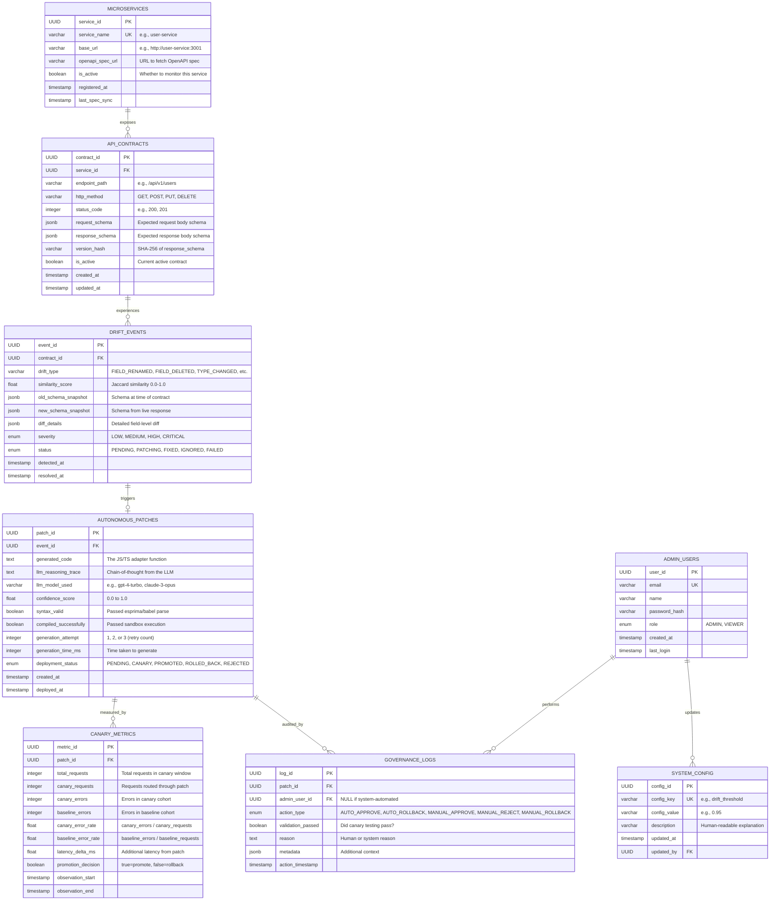
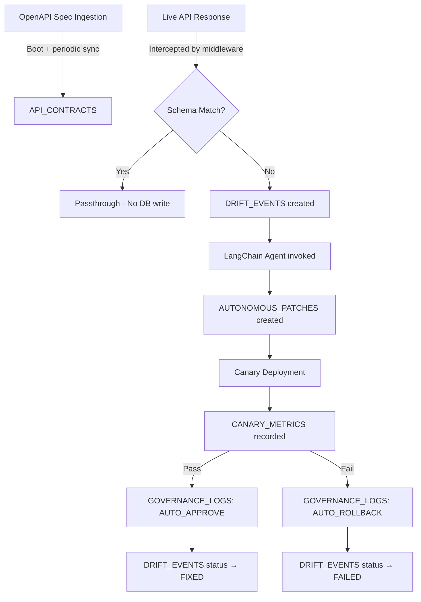

# Chapter 3: Database Schema Design

This chapter details the complete data persistence layer for the Autonomous Micro-Frontend Orchestrator. The database is designed using **PostgreSQL 15+** as the relational store, chosen for its native JSON/JSONB support, ACID compliance, and extensibility. The ORM layer uses **Prisma** for type-safe, auto-generated database clients.

## 3.1 Design Rationale

The data model must support the following operational patterns:

1. **High-write, append-only event logging** — drift events and governance logs are created frequently and rarely updated.
2. **Schema-on-read flexibility** — API schemas are stored as JSONB, enabling flexible querying without rigid column structures.
3. **Auditability** — every system action (detection, generation, deployment, rollback) must be traceable.
4. **Temporal queries** — administrators need to query events by time range, status, and microservice.

## 3.2 Entity Relationship (ER) Diagram



## 3.3 Table Definitions

### 3.3.1 `MICROSERVICES`

Registry of all backend microservices the system monitors.

| Column | Type | Constraints | Description |
|---|---|---|---|
| `service_id` | UUID | PK, DEFAULT gen_random_uuid() | Unique identifier |
| `service_name` | VARCHAR(100) | UNIQUE, NOT NULL | Human-readable name (e.g., `user-service`) |
| `base_url` | VARCHAR(500) | NOT NULL | Base URL for the service |
| `openapi_spec_url` | VARCHAR(500) | NOT NULL | URL to fetch the OpenAPI/Swagger spec |
| `is_active` | BOOLEAN | DEFAULT true | Whether the system should actively monitor this service |
| `registered_at` | TIMESTAMPTZ | DEFAULT NOW() | When the service was registered |
| `last_spec_sync` | TIMESTAMPTZ | NULLABLE | Last time the OpenAPI spec was successfully fetched and parsed |

### 3.3.2 `API_CONTRACTS`

Stores the baseline structural definition of all known API endpoints.

| Column | Type | Constraints | Description |
|---|---|---|---|
| `contract_id` | UUID | PK | Unique identifier |
| `service_id` | UUID | FK → MICROSERVICES, NOT NULL | Which microservice this endpoint belongs to |
| `endpoint_path` | VARCHAR(500) | NOT NULL | Route path (e.g., `/api/v1/users/:id`) |
| `http_method` | VARCHAR(10) | NOT NULL | HTTP method (GET, POST, PUT, DELETE, PATCH) |
| `status_code` | INTEGER | NOT NULL | Expected HTTP status code |
| `request_schema` | JSONB | NULLABLE | Expected request body JSON schema |
| `response_schema` | JSONB | NOT NULL | Expected response body JSON schema |
| `version_hash` | VARCHAR(64) | NOT NULL | SHA-256 hash of `response_schema` for quick comparison |
| `is_active` | BOOLEAN | DEFAULT true | Whether this is the current active contract version |
| `created_at` | TIMESTAMPTZ | DEFAULT NOW() | Creation timestamp |
| `updated_at` | TIMESTAMPTZ | DEFAULT NOW() | Last update timestamp |

**Indexes:**
- `idx_contracts_service_endpoint` on (`service_id`, `endpoint_path`, `http_method`) — for fast lookup during drift detection.
- `idx_contracts_version_hash` on (`version_hash`) — for quick duplicate checking.

### 3.3.3 `DRIFT_EVENTS`

Records every occurrence where a runtime API response deviates from the known contract.

| Column | Type | Constraints | Description |
|---|---|---|---|
| `event_id` | UUID | PK | Unique identifier |
| `contract_id` | UUID | FK → API_CONTRACTS, NOT NULL | Which contract was violated |
| `drift_type` | VARCHAR(50) | NOT NULL | Classification: `FIELD_RENAMED`, `FIELD_DELETED`, `FIELD_ADDED`, `TYPE_CHANGED`, `NESTING_CHANGED`, `MULTI_FIELD_MUTATION` |
| `similarity_score` | FLOAT | NOT NULL, CHECK (0 ≤ val ≤ 1) | Jaccard similarity between old and new schemas |
| `old_schema_snapshot` | JSONB | NOT NULL | The expected schema at time of detection |
| `new_schema_snapshot` | JSONB | NOT NULL | The received schema from the live API response |
| `diff_details` | JSONB | NOT NULL | Structured diff: `{ added: [], removed: [], renamed: [], typeChanged: [] }` |
| `severity` | VARCHAR(10) | NOT NULL | `LOW` (field added), `MEDIUM` (type changed), `HIGH` (field deleted), `CRITICAL` (multiple breaking changes) |
| `status` | VARCHAR(10) | NOT NULL, DEFAULT 'PENDING' | `PENDING`, `PATCHING`, `FIXED`, `IGNORED`, `FAILED` |
| `detected_at` | TIMESTAMPTZ | DEFAULT NOW() | When the drift was first detected |
| `resolved_at` | TIMESTAMPTZ | NULLABLE | When the drift was resolved (patch promoted or ignored) |

**Indexes:**
- `idx_drift_status` on (`status`) — for querying pending drifts.
- `idx_drift_detected_at` on (`detected_at` DESC) — for timeline views.
- `idx_drift_contract` on (`contract_id`) — for joining with contracts.

### 3.3.4 `AUTONOMOUS_PATCHES`

Stores every adapter code artifact generated by the LangChain agent.

| Column | Type | Constraints | Description |
|---|---|---|---|
| `patch_id` | UUID | PK | Unique identifier |
| `event_id` | UUID | FK → DRIFT_EVENTS, NOT NULL | Which drift event triggered this patch |
| `generated_code` | TEXT | NOT NULL | The JavaScript/TypeScript adapter function |
| `llm_reasoning_trace` | TEXT | NULLABLE | Full chain-of-thought reasoning from the LLM |
| `llm_model_used` | VARCHAR(50) | NOT NULL | Model identifier (e.g., `gpt-4-turbo-2024-04-09`) |
| `confidence_score` | FLOAT | NOT NULL, CHECK (0 ≤ val ≤ 1) | LLM's confidence in patch correctness |
| `syntax_valid` | BOOLEAN | NOT NULL | Whether the code passed AST parsing |
| `compiled_successfully` | BOOLEAN | NOT NULL | Whether the code ran without errors in sandbox |
| `generation_attempt` | INTEGER | NOT NULL, DEFAULT 1 | Retry count (1–3) |
| `generation_time_ms` | INTEGER | NOT NULL | Milliseconds taken to generate the patch |
| `deployment_status` | VARCHAR(15) | NOT NULL, DEFAULT 'PENDING' | `PENDING`, `CANARY`, `PROMOTED`, `ROLLED_BACK`, `REJECTED` |
| `created_at` | TIMESTAMPTZ | DEFAULT NOW() | Generation timestamp |
| `deployed_at` | TIMESTAMPTZ | NULLABLE | When the patch was first deployed to canary |

### 3.3.5 `CANARY_METRICS`

Captures performance measurements during the canary deployment phase.

| Column | Type | Constraints | Description |
|---|---|---|---|
| `metric_id` | UUID | PK | Unique identifier |
| `patch_id` | UUID | FK → AUTONOMOUS_PATCHES, NOT NULL | Which patch is being evaluated |
| `total_requests` | INTEGER | NOT NULL | Total requests during observation window |
| `canary_requests` | INTEGER | NOT NULL | Requests routed through the patch |
| `canary_errors` | INTEGER | NOT NULL, DEFAULT 0 | Errors from canary cohort |
| `baseline_errors` | INTEGER | NOT NULL, DEFAULT 0 | Errors from baseline cohort |
| `canary_error_rate` | FLOAT | NOT NULL | `canary_errors / canary_requests` |
| `baseline_error_rate` | FLOAT | NOT NULL | `baseline_errors / (total_requests - canary_requests)` |
| `latency_delta_ms` | FLOAT | NOT NULL | Average additional latency introduced by the patch |
| `promotion_decision` | BOOLEAN | NOT NULL | `true` = promote to 100%, `false` = rollback |
| `observation_start` | TIMESTAMPTZ | NOT NULL | Start of the canary observation window |
| `observation_end` | TIMESTAMPTZ | NOT NULL | End of the canary observation window |

### 3.3.6 `GOVERNANCE_LOGS`

Audit trail of all administrative and automated system actions.

| Column | Type | Constraints | Description |
|---|---|---|---|
| `log_id` | UUID | PK | Unique identifier |
| `patch_id` | UUID | FK → AUTONOMOUS_PATCHES, NOT NULL | Which patch this action relates to |
| `admin_user_id` | UUID | FK → ADMIN_USERS, NULLABLE | NULL for automated actions |
| `action_type` | VARCHAR(20) | NOT NULL | `AUTO_APPROVE`, `AUTO_ROLLBACK`, `MANUAL_APPROVE`, `MANUAL_REJECT`, `MANUAL_ROLLBACK` |
| `validation_passed` | BOOLEAN | NOT NULL | Whether canary validation passed |
| `reason` | TEXT | NULLABLE | Human or system explanation |
| `metadata` | JSONB | NULLABLE | Additional context (e.g., canary metrics at time of decision) |
| `action_timestamp` | TIMESTAMPTZ | DEFAULT NOW() | When the action was taken |

### 3.3.7 `ADMIN_USERS`

User accounts for the governance dashboard.

| Column | Type | Constraints | Description |
|---|---|---|---|
| `user_id` | UUID | PK | Unique identifier |
| `email` | VARCHAR(255) | UNIQUE, NOT NULL | Login email |
| `name` | VARCHAR(100) | NOT NULL | Display name |
| `password_hash` | VARCHAR(255) | NOT NULL | bcrypt hashed password |
| `role` | VARCHAR(10) | NOT NULL, DEFAULT 'VIEWER' | `ADMIN` or `VIEWER` |
| `created_at` | TIMESTAMPTZ | DEFAULT NOW() | Account creation |
| `last_login` | TIMESTAMPTZ | NULLABLE | Last successful login |

### 3.3.8 `SYSTEM_CONFIG`

Runtime-configurable system parameters.

| Column | Type | Constraints | Description |
|---|---|---|---|
| `config_id` | UUID | PK | Unique identifier |
| `config_key` | VARCHAR(100) | UNIQUE, NOT NULL | Configuration key |
| `config_value` | VARCHAR(500) | NOT NULL | Configuration value |
| `description` | TEXT | NULLABLE | Human-readable description |
| `updated_at` | TIMESTAMPTZ | DEFAULT NOW() | Last update |
| `updated_by` | UUID | FK → ADMIN_USERS, NULLABLE | Who updated this config |

**Default Configuration Entries:**

| Key | Default Value | Description |
|---|---|---|
| `drift_threshold` | `0.95` | Minimum Jaccard similarity before flagging drift |
| `confidence_threshold` | `0.60` | Minimum AI confidence for auto-deployment |
| `canary_percentage` | `10` | Percentage of traffic for canary routing |
| `canary_window_seconds` | `60` | Duration of canary observation |
| `canary_error_tolerance` | `0.05` | Max error rate delta before rollback |
| `max_generation_retries` | `3` | Max LLM retry attempts |
| `spec_sync_interval_seconds` | `60` | How often to re-fetch OpenAPI specs |
| `llm_timeout_seconds` | `30` | Max time to wait for LLM response |

## 3.4 Prisma Schema Definition

```prisma
generator client {
  provider = "prisma-client-js"
}

datasource db {
  provider = "postgresql"
  url      = env("DATABASE_URL")
}

model Microservice {
  id             String        @id @default(uuid()) @map("service_id")
  serviceName    String        @unique @map("service_name")
  baseUrl        String        @map("base_url")
  openapiSpecUrl String        @map("openapi_spec_url")
  isActive       Boolean       @default(true) @map("is_active")
  registeredAt   DateTime      @default(now()) @map("registered_at")
  lastSpecSync   DateTime?     @map("last_spec_sync")
  contracts      ApiContract[]

  @@map("microservices")
}

model ApiContract {
  id              String       @id @default(uuid()) @map("contract_id")
  serviceId       String       @map("service_id")
  endpointPath    String       @map("endpoint_path")
  httpMethod      String       @map("http_method")
  statusCode      Int          @map("status_code")
  requestSchema   Json?        @map("request_schema")
  responseSchema  Json         @map("response_schema")
  versionHash     String       @map("version_hash")
  isActive        Boolean      @default(true) @map("is_active")
  createdAt       DateTime     @default(now()) @map("created_at")
  updatedAt       DateTime     @default(now()) @map("updated_at")
  service         Microservice @relation(fields: [serviceId], references: [id])
  driftEvents     DriftEvent[]

  @@index([serviceId, endpointPath, httpMethod])
  @@index([versionHash])
  @@map("api_contracts")
}

model DriftEvent {
  id                String           @id @default(uuid()) @map("event_id")
  contractId        String           @map("contract_id")
  driftType         String           @map("drift_type")
  similarityScore   Float            @map("similarity_score")
  oldSchemaSnapshot Json             @map("old_schema_snapshot")
  newSchemaSnapshot Json             @map("new_schema_snapshot")
  diffDetails       Json             @map("diff_details")
  severity          String
  status            String           @default("PENDING")
  detectedAt        DateTime         @default(now()) @map("detected_at")
  resolvedAt        DateTime?        @map("resolved_at")
  contract          ApiContract      @relation(fields: [contractId], references: [id])
  patch             AutonomousPatch?

  @@index([status])
  @@index([detectedAt(sort: Desc)])
  @@index([contractId])
  @@map("drift_events")
}

model AutonomousPatch {
  id                    String          @id @default(uuid()) @map("patch_id")
  eventId               String          @unique @map("event_id")
  generatedCode         String          @map("generated_code")
  llmReasoningTrace     String?         @map("llm_reasoning_trace")
  llmModelUsed          String          @map("llm_model_used")
  confidenceScore       Float           @map("confidence_score")
  syntaxValid           Boolean         @map("syntax_valid")
  compiledSuccessfully  Boolean         @map("compiled_successfully")
  generationAttempt     Int             @default(1) @map("generation_attempt")
  generationTimeMs      Int             @map("generation_time_ms")
  deploymentStatus      String          @default("PENDING") @map("deployment_status")
  createdAt             DateTime        @default(now()) @map("created_at")
  deployedAt            DateTime?       @map("deployed_at")
  event                 DriftEvent      @relation(fields: [eventId], references: [id])
  canaryMetrics         CanaryMetric[]
  governanceLogs        GovernanceLog[]

  @@map("autonomous_patches")
}

model CanaryMetric {
  id                String          @id @default(uuid()) @map("metric_id")
  patchId           String          @map("patch_id")
  totalRequests     Int             @map("total_requests")
  canaryRequests    Int             @map("canary_requests")
  canaryErrors      Int             @default(0) @map("canary_errors")
  baselineErrors    Int             @default(0) @map("baseline_errors")
  canaryErrorRate   Float           @map("canary_error_rate")
  baselineErrorRate Float           @map("baseline_error_rate")
  latencyDeltaMs    Float           @map("latency_delta_ms")
  promotionDecision Boolean         @map("promotion_decision")
  observationStart  DateTime        @map("observation_start")
  observationEnd    DateTime        @map("observation_end")
  patch             AutonomousPatch @relation(fields: [patchId], references: [id])

  @@map("canary_metrics")
}

model GovernanceLog {
  id               String           @id @default(uuid()) @map("log_id")
  patchId          String           @map("patch_id")
  adminUserId      String?          @map("admin_user_id")
  actionType       String           @map("action_type")
  validationPassed Boolean          @map("validation_passed")
  reason           String?
  metadata         Json?
  actionTimestamp   DateTime         @default(now()) @map("action_timestamp")
  patch            AutonomousPatch  @relation(fields: [patchId], references: [id])
  admin            AdminUser?       @relation(fields: [adminUserId], references: [id])

  @@map("governance_logs")
}

model AdminUser {
  id            String          @id @default(uuid()) @map("user_id")
  email         String          @unique
  name          String
  passwordHash  String          @map("password_hash")
  role          String          @default("VIEWER")
  createdAt     DateTime        @default(now()) @map("created_at")
  lastLogin     DateTime?       @map("last_login")
  logs          GovernanceLog[]
  configs       SystemConfig[]

  @@map("admin_users")
}

model SystemConfig {
  id          String    @id @default(uuid()) @map("config_id")
  configKey   String    @unique @map("config_key")
  configValue String    @map("config_value")
  description String?
  updatedAt   DateTime  @default(now()) @map("updated_at")
  updatedBy   String?   @map("updated_by")
  updatedByUser AdminUser? @relation(fields: [updatedBy], references: [id])

  @@map("system_config")
}
```

## 3.5 Data Flow Summary


