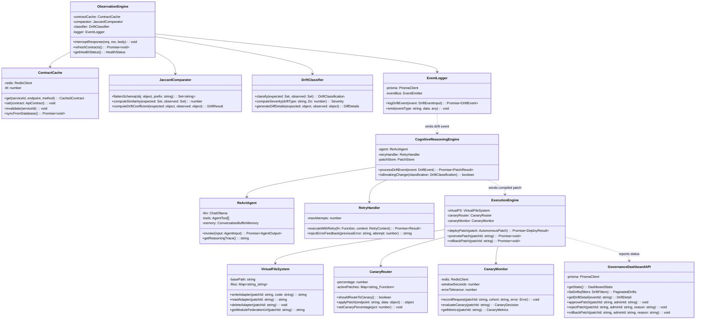

# Chapter 7: Detailed Design and Implementation

This chapter provides the low-level design artifacts required for implementation — class diagrams, sequence diagrams, API contracts, data flow diagrams, and key algorithm pseudocode.

## 7.1 Class Diagram



## 7.2 Core Algorithm: Schema Drift Detection Pipeline

```typescript
// Pseudocode for the complete drift detection pipeline

async function handleApiResponse(
  endpoint: string,
  method: string,
  statusCode: number,
  responseBody: object
): Promise<void> {
  // Step 1: Look up the expected contract from cache
  const contract = await contractCache.get(endpoint, method, statusCode);
  if (!contract) {
    logger.warn(`No contract found for ${method} ${endpoint} ${statusCode}`);
    return; // No baseline to compare against; pass through
  }

  // Step 2: Flatten both schemas into key-path sets
  const expectedKeys = jaccardComparator.flattenSchema(contract.responseSchema);
  const observedKeys = jaccardComparator.flattenSchema(responseBody);

  // Step 3: Compute Jaccard similarity and drift coefficient
  const similarity = jaccardComparator.computeSimilarity(expectedKeys, observedKeys);
  const Dc = 1 - similarity;

  // Step 4: Check against threshold
  const threshold = await configManager.get('drift_threshold'); // default: 0.05
  if (Dc < threshold) {
    return; // No significant drift; pass through
  }

  // Step 5: Classify the drift
  const classification = driftClassifier.classify(expectedKeys, observedKeys);
  const severity = driftClassifier.computeSeverity(classification.type, Dc);
  const diffDetails = driftClassifier.generateDiffDetails(
    contract.responseSchema, responseBody
  );

  // Step 6: Log the drift event
  const driftEvent = await eventLogger.logDriftEvent({
    contractId: contract.id,
    driftType: classification.type,
    similarityScore: similarity,
    oldSchemaSnapshot: contract.responseSchema,
    newSchemaSnapshot: responseBody,
    diffDetails: diffDetails,
    severity: severity,
    status: 'PENDING',
  });

  // Step 7: Emit event to trigger the Cognitive Reasoning Engine
  eventLogger.emit('drift:detected', driftEvent);
}
```

## 7.3 Core Algorithm: LangChain Agent Patch Generation

```typescript
// Pseudocode for the cognitive reasoning and patch generation pipeline

async function processDriftEvent(event: DriftEvent): Promise<PatchResult> {
  // Step 1: Determine if this is a breaking change
  const isBreaking = isBreakingChange(event.driftType);
  if (!isBreaking) {
    // Non-breaking (e.g., field added) — log and skip
    await updateDriftStatus(event.id, 'IGNORED');
    return { action: 'SKIPPED', reason: 'Non-breaking change' };
  }

  // Step 2: Attempt patch generation with retry
  let patch: GeneratedPatch | null = null;
  let lastError: string = '';

  for (let attempt = 1; attempt <= MAX_RETRIES; attempt++) {
    try {
      // Step 2a: Construct the agent input
      const agentInput = buildAgentInput(event, lastError, attempt);

      // Step 2b: Invoke the LangChain ReAct agent
      const agentOutput = await reactAgent.invoke(agentInput);

      // Step 2c: Extract the generated code
      const generatedCode = extractCodeFromOutput(agentOutput);

      // Step 2d: Validate syntax with esprima
      const syntaxResult = validateSyntax(generatedCode);
      if (!syntaxResult.valid) {
        lastError = syntaxResult.errors.join('; ');
        continue; // Retry with error feedback
      }

      // Step 2e: Sandbox execution test
      const sandboxResult = await testInSandbox(generatedCode, event.oldSchemaSnapshot);
      if (!sandboxResult.success) {
        lastError = sandboxResult.error;
        continue; // Retry
      }

      // Step 2f: Success — create the patch record
      patch = {
        code: generatedCode,
        reasoningTrace: agentOutput.reasoningTrace,
        confidence: agentOutput.confidence,
        syntaxValid: true,
        compiled: true,
        attempt: attempt,
        generationTimeMs: agentOutput.latencyMs,
      };
      break;

    } catch (error) {
      lastError = error.message;
      if (attempt === MAX_RETRIES) {
        // All retries exhausted
        await storePatch({
          eventId: event.id,
          generatedCode: '',
          syntaxValid: false,
          compiled: false,
          attempt: attempt,
          deploymentStatus: 'REJECTED',
        });
        return { action: 'FAILED', reason: `All ${MAX_RETRIES} attempts failed` };
      }
    }
  }

  // Step 3: Store the successful patch
  const storedPatch = await storePatch({
    eventId: event.id,
    generatedCode: patch.code,
    llmReasoningTrace: patch.reasoningTrace,
    confidenceScore: patch.confidence,
    syntaxValid: patch.syntaxValid,
    compiled: patch.compiled,
    generationAttempt: patch.attempt,
    generationTimeMs: patch.generationTimeMs,
    deploymentStatus: 'PENDING',
  });

  // Step 4: Check confidence threshold
  const confidenceThreshold = await configManager.get('confidence_threshold');
  if (patch.confidence < confidenceThreshold) {
    // Flag for human review — do not auto-deploy
    await flagForHumanReview(storedPatch.id);
    return { action: 'HUMAN_REVIEW', patchId: storedPatch.id };
  }

  // Step 5: Trigger deployment
  await executionEngine.deployPatch(storedPatch);
  return { action: 'DEPLOYED', patchId: storedPatch.id };
}
```

## 7.4 Core Algorithm: Canary Deployment and Evaluation

```typescript
// Pseudocode for canary deployment lifecycle

async function deployPatch(patch: AutonomousPatch): Promise<void> {
  // Step 1: Write adapter to Virtual File System
  const adapterPath = virtualFS.writeAdapter(patch.id, patch.generatedCode);

  // Step 2: Expose via Module Federation
  const remoteUrl = virtualFS.getModuleFederationUrl(patch.id);
  await moduleFederation.exposeRemote(patch.id, remoteUrl);

  // Step 3: Activate canary routing
  const canaryPct = await configManager.get('canary_percentage'); // default: 10
  canaryRouter.activatePatch(patch.eventId, patch.generatedCode, canaryPct);

  // Step 4: Update deployment status
  await updatePatchStatus(patch.id, 'CANARY');

  // Step 5: Start observation window
  const windowSeconds = await configManager.get('canary_window_seconds'); // default: 60

  // Wait for observation window
  await sleep(windowSeconds * 1000);

  // Step 6: Evaluate canary metrics
  const decision = await canaryMonitor.evaluateCanary(patch.id);
  const metrics = await canaryMonitor.getMetrics(patch.id);

  // Step 7: Store canary metrics
  await storeCanaryMetrics({
    patchId: patch.id,
    totalRequests: metrics.totalRequests,
    canaryRequests: metrics.canaryRequests,
    canaryErrors: metrics.canaryErrors,
    baselineErrors: metrics.baselineErrors,
    canaryErrorRate: metrics.canaryErrorRate,
    baselineErrorRate: metrics.baselineErrorRate,
    latencyDeltaMs: metrics.latencyDeltaMs,
    promotionDecision: decision.promote,
  });

  // Step 8: Promote or rollback
  if (decision.promote) {
    await promotePatch(patch.id);
    await logGovernanceAction(patch.id, null, 'AUTO_APPROVE', true, 'Canary passed');
    await updateDriftStatus(patch.eventId, 'FIXED');
  } else {
    await rollbackPatch(patch.id);
    await logGovernanceAction(patch.id, null, 'AUTO_ROLLBACK', false, decision.reason);
    await updateDriftStatus(patch.eventId, 'FAILED');
  }
}
```

## 7.5 API Specification: Gateway REST Endpoints

### 7.5.1 Dashboard API

```yaml
openapi: 3.0.3
info:
  title: Orchestrator Dashboard API
  version: 1.0.0

paths:
  /api/auth/login:
    post:
      summary: Authenticate admin user
      requestBody:
        content:
          application/json:
            schema:
              type: object
              properties:
                email: { type: string, format: email }
                password: { type: string }
              required: [email, password]
      responses:
        '200':
          description: JWT token returned
          content:
            application/json:
              schema:
                type: object
                properties:
                  token: { type: string }
                  user: { $ref: '#/components/schemas/AdminUser' }
        '401':
          description: Invalid credentials

  /api/dashboard/stats:
    get:
      summary: Aggregate system statistics
      security: [{ bearerAuth: [] }]
      responses:
        '200':
          content:
            application/json:
              schema:
                type: object
                properties:
                  totalDrifts: { type: integer }
                  pendingDrifts: { type: integer }
                  fixedDrifts: { type: integer }
                  failedDrifts: { type: integer }
                  totalPatches: { type: integer }
                  avgConfidence: { type: number }
                  avgGenerationTimeMs: { type: integer }
                  successRate: { type: number }
                  activeServices: { type: integer }

  /api/dashboard/drifts:
    get:
      summary: List drift events with pagination
      security: [{ bearerAuth: [] }]
      parameters:
        - name: page
          in: query
          schema: { type: integer, default: 1 }
        - name: limit
          in: query
          schema: { type: integer, default: 20 }
        - name: status
          in: query
          schema: { type: string, enum: [PENDING, PATCHING, FIXED, IGNORED, FAILED] }
        - name: severity
          in: query
          schema: { type: string, enum: [LOW, MEDIUM, HIGH, CRITICAL] }
        - name: serviceId
          in: query
          schema: { type: string, format: uuid }
      responses:
        '200':
          content:
            application/json:
              schema:
                type: object
                properties:
                  data: { type: array, items: { $ref: '#/components/schemas/DriftEvent' } }
                  total: { type: integer }
                  page: { type: integer }
                  totalPages: { type: integer }

  /api/dashboard/drifts/{eventId}:
    get:
      summary: Get drift event detail with schema diff and patch info
      security: [{ bearerAuth: [] }]
      parameters:
        - name: eventId
          in: path
          required: true
          schema: { type: string, format: uuid }

  /api/dashboard/patches/{patchId}/approve:
    post:
      summary: Manually approve a pending patch
      security: [{ bearerAuth: [] }]
      parameters:
        - name: patchId
          in: path
          required: true
          schema: { type: string, format: uuid }

  /api/dashboard/patches/{patchId}/reject:
    post:
      summary: Manually reject a patch
      security: [{ bearerAuth: [] }]
      requestBody:
        content:
          application/json:
            schema:
              type: object
              properties:
                reason: { type: string }
              required: [reason]

  /api/dashboard/patches/{patchId}/rollback:
    post:
      summary: Manually rollback a promoted patch
      security: [{ bearerAuth: [] }]
      requestBody:
        content:
          application/json:
            schema:
              type: object
              properties:
                reason: { type: string }
              required: [reason]

  /api/dashboard/services:
    get:
      summary: List registered microservices
      security: [{ bearerAuth: [] }]
    post:
      summary: Register a new microservice
      security: [{ bearerAuth: [] }]
      requestBody:
        content:
          application/json:
            schema:
              type: object
              properties:
                serviceName: { type: string }
                baseUrl: { type: string, format: uri }
                openapiSpecUrl: { type: string, format: uri }
              required: [serviceName, baseUrl, openapiSpecUrl]

  /api/dashboard/config:
    get:
      summary: Get all system configuration values
      security: [{ bearerAuth: [] }]
    put:
      summary: Update a configuration value
      security: [{ bearerAuth: [] }]
      requestBody:
        content:
          application/json:
            schema:
              type: object
              properties:
                key: { type: string }
                value: { type: string }
              required: [key, value]
```

## 7.6 TypeScript Interface Definitions

```typescript
// Core domain types used across all modules

interface DriftResult {
  driftCoefficient: number;     // Dc value (0.0 - 1.0)
  similarity: number;           // Jaccard similarity (0.0 - 1.0)
  isSignificant: boolean;       // Dc >= threshold
}

interface DriftClassification {
  type: 'FIELD_RENAMED' | 'FIELD_DELETED' | 'FIELD_ADDED' |
        'TYPE_CHANGED' | 'NESTING_CHANGED' | 'MULTI_FIELD_MUTATION';
  affectedFields: FieldChange[];
}

interface FieldChange {
  path: string;                 // e.g., "user.firstName"
  changeType: 'renamed' | 'deleted' | 'added' | 'typeChanged' | 'nestingChanged';
  oldValue?: string;            // Old field name or type
  newValue?: string;            // New field name or type
}

interface DiffDetails {
  added: string[];              // Fields present in new but not old
  removed: string[];            // Fields present in old but not new
  renamed: { from: string; to: string }[];
  typeChanged: { field: string; from: string; to: string }[];
}

type Severity = 'LOW' | 'MEDIUM' | 'HIGH' | 'CRITICAL';
type DriftStatus = 'PENDING' | 'PATCHING' | 'FIXED' | 'IGNORED' | 'FAILED';
type DeploymentStatus = 'PENDING' | 'CANARY' | 'PROMOTED' | 'ROLLED_BACK' | 'REJECTED';

interface AgentInput {
  endpoint: string;
  oldSchema: object;
  newSchema: object;
  diffDetails: DiffDetails;
  previousError?: string;       // Populated on retry attempts
  attempt: number;
}

interface AgentOutput {
  generatedCode: string;
  reasoningTrace: string;
  confidence: number;
  latencyMs: number;
}

interface CanaryDecision {
  promote: boolean;
  reason: string;
  canaryErrorRate: number;
  baselineErrorRate: number;
  latencyDeltaMs: number;
}

interface PatchResult {
  action: 'DEPLOYED' | 'HUMAN_REVIEW' | 'SKIPPED' | 'FAILED';
  patchId?: string;
  reason?: string;
}

interface DashboardStats {
  totalDrifts: number;
  pendingDrifts: number;
  fixedDrifts: number;
  failedDrifts: number;
  totalPatches: number;
  avgConfidence: number;
  avgGenerationTimeMs: number;
  successRate: number;          // fixedDrifts / totalDrifts
  activeServices: number;
}

interface HealthStatus {
  status: 'HEALTHY' | 'DEGRADED' | 'DOWN';
  components: {
    database: boolean;
    redis: boolean;
    llmApi: boolean;
    moduleFederation: boolean;
  };
  uptime: number;               // seconds
  lastDriftDetected?: string;   // ISO timestamp
}
```

## 7.7 Error Handling Strategy

| Error Scenario | Detection | Response | Recovery |
|---|---|---|---|
| LLM API timeout | HTTP timeout (30s) | Retry up to 3 times with exponential backoff | Fallback to last stable build |
| LLM API rate limit (429) | HTTP status code | Queue drift event; retry after `Retry-After` header | Process queue on timer |
| Generated code syntax error | esprima parse failure | Retry with error message as context | Max 3 retries then escalate |
| Generated code runtime error | Sandbox `vm2` throws | Retry with error message as context | Max 3 retries then escalate |
| Canary error rate spike | Metric threshold breach | Immediate rollback | Log governance event; alert admin |
| Database connection lost | Prisma connection error | Queue events in Redis; retry with exponential backoff | Auto-reconnect via Prisma |
| Redis connection lost | ioredis connection error | Fall back to in-memory contract cache | Auto-reconnect via ioredis |
| Module Federation load failure | Script tag `onerror` | Serve unpatched response | Alert admin; mark patch as failed |
