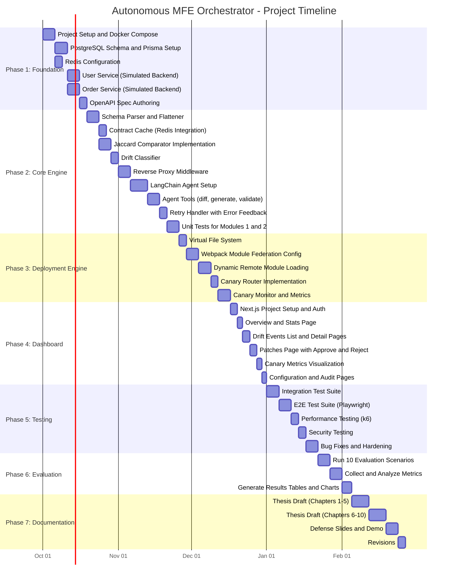

# Chapter 9: Project Timeline, Risk Analysis, and Deliverables

This chapter outlines the project timeline with a detailed Gantt chart, milestones, risk register with mitigation strategies, and the list of final deliverables.

## 9.1 Project Timeline

### 9.1.1 Phase Overview

| Phase | Duration | Dates | Description |
|---|---|---|---|
| **Phase 1: Foundation** | 3 weeks | Oct 1 – Oct 21, 2026 | Infrastructure, database, simulated backend services |
| **Phase 2: Core Engine** | 5 weeks | Oct 22 – Nov 25, 2026 | Observation Engine + Cognitive Reasoning Engine |
| **Phase 3: Deployment** | 3 weeks | Nov 26 – Dec 16, 2026 | Execution Engine + Module Federation integration |
| **Phase 4: Dashboard** | 2 weeks | Dec 17 – Dec 30, 2026 | Governance Dashboard (Next.js) |
| **Phase 5: Testing** | 3 weeks | Jan 1 – Jan 21, 2027 | Integration, E2E, performance, security testing |
| **Phase 6: Evaluation** | 2 weeks | Jan 22 – Feb 4, 2027 | Run evaluation scenarios, collect metrics, analyze results |
| **Phase 7: Documentation** | 3 weeks | Feb 5 – Feb 25, 2027 | Thesis writing, defense preparation |
| **Buffer** | 1 week | Feb 26 – Mar 4, 2027 | Contingency for delays |

### 9.1.2 Detailed Gantt Chart



### 9.1.3 Key Milestones

| Milestone | Date | Deliverable | Gate Criteria |
|---|---|---|---|
| **M1: Infrastructure Ready** | Oct 21, 2026 | Docker Compose with all services booting successfully | All containers start; DB migrations run; simulated APIs return data |
| **M2: Drift Detection Working** | Nov 11, 2026 | Observation Engine detects schema changes | Unit tests pass; Dc computed correctly for 10+ test cases |
| **M3: AI Patch Generation Working** | Nov 25, 2026 | LangChain agent generates valid adapter code | ≥70% of test drifts produce compilable patches |
| **M4: Canary Deployment Working** | Dec 16, 2026 | Full pipeline from detection → canary → promotion | E2E-1 test case passes |
| **M5: Dashboard Functional** | Dec 30, 2026 | Dashboard displays real data and supports governance actions | All dashboard pages render; approve/reject/rollback work |
| **M6: Testing Complete** | Jan 21, 2027 | All test suites pass | ≥85% patch success rate; ≤50ms passthrough latency |
| **M7: Evaluation Complete** | Feb 4, 2027 | Results tables and analysis ready | 10 scenarios executed; all metrics computed |
| **M8: Thesis Submitted** | Feb 25, 2027 | Complete thesis document | All chapters reviewed; formatted per university guidelines |

## 9.2 Risk Analysis

### 9.2.1 Risk Register

| Risk ID | Risk Description | Probability | Impact | Severity | Mitigation Strategy | Contingency Plan |
|---|---|---|---|---|---|---|
| **R1** | LLM API generates incorrect/hallucinated adapter code | High | High | **Critical** | Syntax validation (esprima); sandbox execution; canary routing; confidence thresholds | Human-in-the-loop review for low-confidence patches; manual adapter writing as fallback |
| **R2** | LLM API rate limits or downtime during demo/evaluation | Medium | High | **High** | Use multiple LLM providers (OpenAI + Anthropic); implement fallback chain | Pre-generate patches for demo scenarios; cache known good patches |
| **R3** | Webpack Module Federation fails to hot-swap modules at runtime | Medium | High | **High** | Early spike/POC in Phase 1; test with React 18 compatibility | Fall back to full page reload injection mechanism |
| **R4** | Schema drift too complex for LLM (deeply nested, multi-level) | Medium | Medium | **Medium** | Limit scope to 3 levels of nesting; break complex drifts into sub-problems | Flag complex drifts for human review; document as a known limitation |
| **R5** | Performance overhead exceeds NFR thresholds | Low | High | **Medium** | Profile early; optimize Jaccard comparison with hash sets; cache aggressively | Relax thresholds if justified by evaluation data |
| **R6** | OpenAI API costs exceed budget during development/testing | Medium | Medium | **Medium** | Use GPT-3.5-turbo for development; GPT-4 only for final evaluation; set monthly spend cap | Switch to open-source model (CodeLlama via Ollama) for development |
| **R7** | Docker Compose environment differs across team members' OS | Low | Low | **Low** | Pin all image versions; use `.env.example` with defaults; CI/CD with fixed environment | Document OS-specific troubleshooting steps |
| **R8** | Scope creep — adding features beyond the defined scope | Medium | Medium | **Medium** | Strict scope document (Chapter 1, Section 1.7); phase gates at milestones | Defer new features to "Future Work" section of thesis |
| **R9** | Academic advisor requests significant architectural changes | Low | High | **Medium** | Regular bi-weekly check-ins; share architecture docs early for feedback | Maintain modular architecture so components can be swapped |
| **R10** | Time overrun in Phase 2 (AI integration is harder than expected) | Medium | High | **High** | Start LangChain integration early in Phase 2; parallel development of tools and agent | Use 1-week buffer; reduce evaluation scenarios from 10 to 5 |

### 9.2.2 Risk Severity Matrix

```
             ┌──────────────────────────────────┐
             │           IMPACT                 │
             │   Low      Medium     High       │
    ┌────────┼──────────────────────────────────┤
    │ High   │           R6        R1           │
P   │ Medium │  R8       R4,R8     R2,R3,R10   │
R   │ Low    │  R7       R9        R5           │
O   └────────┼──────────────────────────────────┤
B            └──────────────────────────────────┘
```

## 9.3 Resource Requirements

### 9.3.1 Hardware

| Resource | Specification | Purpose |
|---|---|---|
| Development Machine | MacOS/Linux, 16GB+ RAM, 256GB+ SSD | Local Docker development |
| Cloud VM (Optional) | 4 vCPU, 8GB RAM (e.g., AWS t3.large) | CI/CD and load testing |

### 9.3.2 Software and Services

| Resource | Cost | Notes |
|---|---|---|
| OpenAI GPT-4 API | ~$50-100/month | Development + evaluation; budget cap |
| Anthropic Claude API | ~$30-50/month | Fallback LLM; lower usage |
| Docker Desktop | Free (personal) | Container runtime |
| PostgreSQL | Free (open source) | Database |
| Redis | Free (open source) | Cache |
| GitHub | Free (student) | Version control |
| Playwright | Free (open source) | E2E testing |
| k6 | Free (open source) | Load testing |

### 9.3.3 Team Allocation

| Role | Person | Responsibilities |
|---|---|---|
| **Developer (Full Stack)** | Project Owner | All development, testing, and documentation |
| **Academic Supervisor** | Advisor | Bi-weekly reviews, thesis guidance |
| **External Examiner** | University | Final evaluation |

## 9.4 Deliverables

### 9.4.1 Software Deliverables

| Deliverable | Description | Format |
|---|---|---|
| **Source Code** | Complete codebase for all 4 modules + simulated services | GitHub repository |
| **Docker Compose** | Single-command deployment of the entire system | `docker-compose.yml` |
| **Database Migrations** | Prisma migration files for PostgreSQL | `prisma/migrations/` |
| **Test Suite** | Unit, integration, E2E, and performance tests | Jest + Playwright + k6 |
| **Demo Script** | Step-by-step instructions to run the demo scenario | `README.md` |

### 9.4.2 Documentation Deliverables

| Deliverable | Description | Format |
|---|---|---|
| **Thesis Document** | Complete academic thesis (Chapters 1-10) | PDF |
| **Defense Slides** | Presentation for thesis defense | PowerPoint/PDF |
| **User Manual** | Dashboard usage guide for administrators | Markdown |
| **API Documentation** | OpenAPI specs for all REST endpoints | YAML + Swagger UI |
| **Architecture Decision Records (ADRs)** | Key design decisions with rationale | Markdown |

### 9.4.3 Evaluation Deliverables

| Deliverable | Description | Format |
|---|---|---|
| **Evaluation Results** | Tables and charts for all metrics | Markdown + images |
| **Performance Report** | k6 load test results with percentiles | HTML report |
| **Security Audit** | Results of security test cases | Markdown |
| **Comparison Study** | Manual vs automated adapter writing (time study) | Table + analysis |

## 9.5 Future Work

Features explicitly deferred to future research or development cycles:

1. **Semantic Drift Detection** — Using NLP to detect when field meanings change without structural changes (e.g., `status` changing from order status to payment status).
2. **GraphQL and gRPC Support** — Extending the observation engine to handle non-REST protocols.
3. **Multi-Language Frontend Support** — Generating adapters for Python (Django templates), Dart (Flutter), or Swift frontends.
4. **Custom Fine-Tuned Model** — Training a domain-specific LLM on adapter generation tasks for higher accuracy and lower latency.
5. **Production Deployment** — Kubernetes-based deployment with horizontal pod autoscaling, service mesh integration, and production-grade monitoring (Prometheus, Grafana).
6. **Multi-Tenancy** — Supporting multiple organizations with isolated data and configuration.
7. **Real-Time Dashboard via WebSockets** — Replacing polling with Server-Sent Events or WebSocket connections for live updates.
8. **Historical Trend Analysis** — ML-based prediction of which services are most likely to introduce breaking changes based on historical drift patterns.
